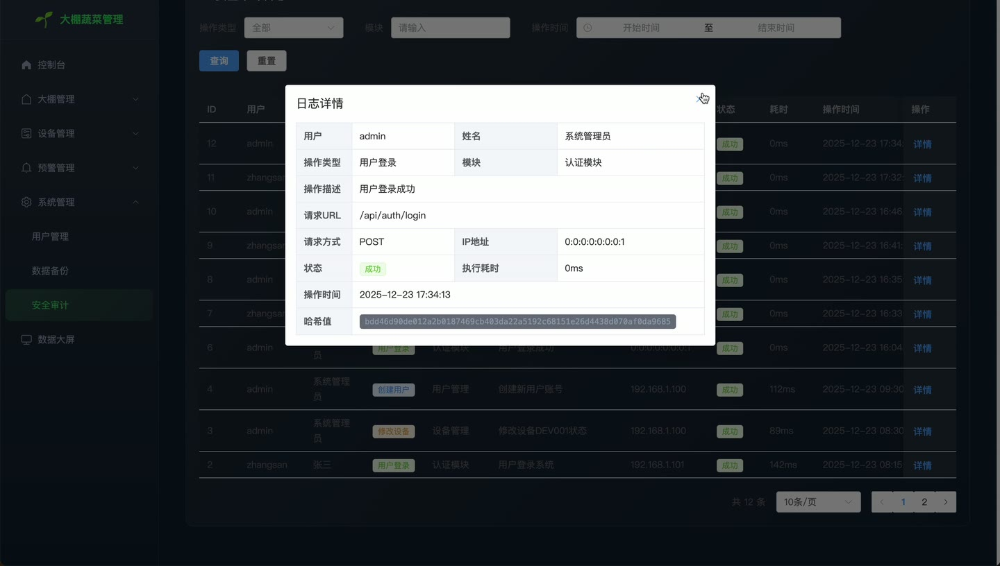
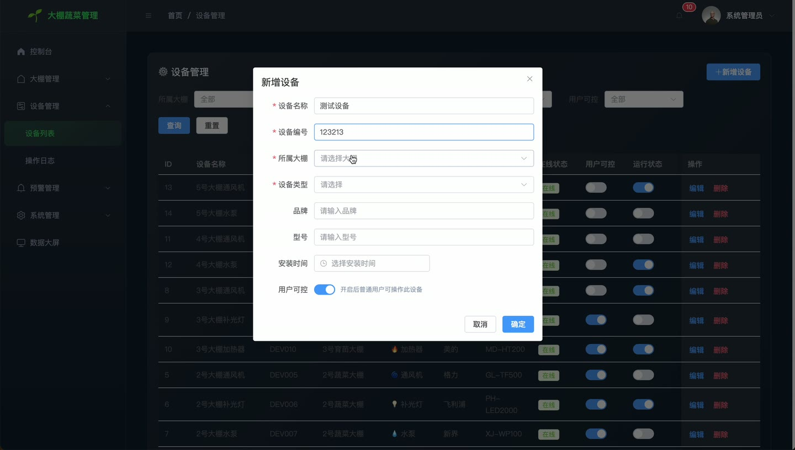
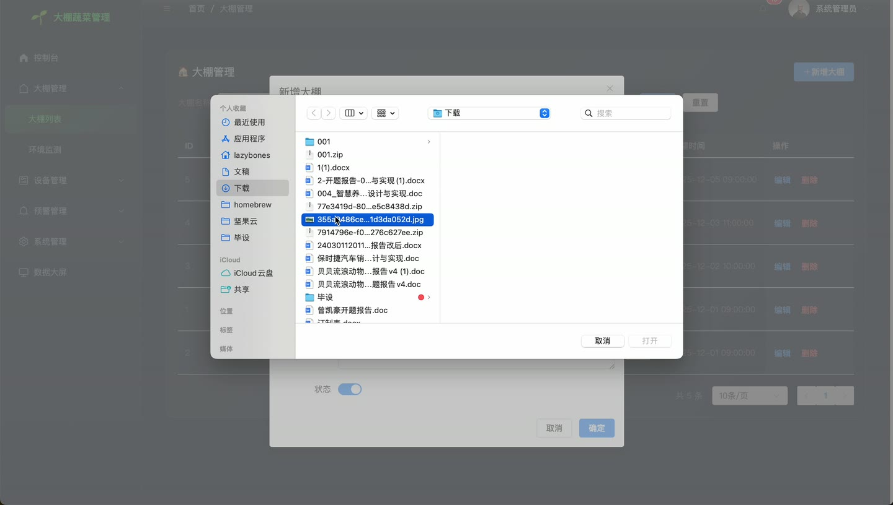
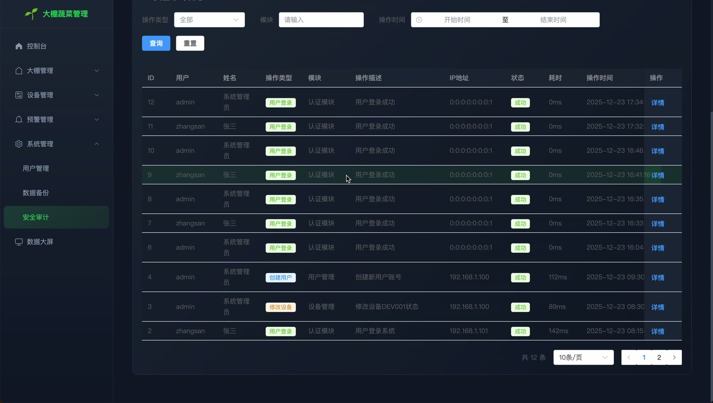
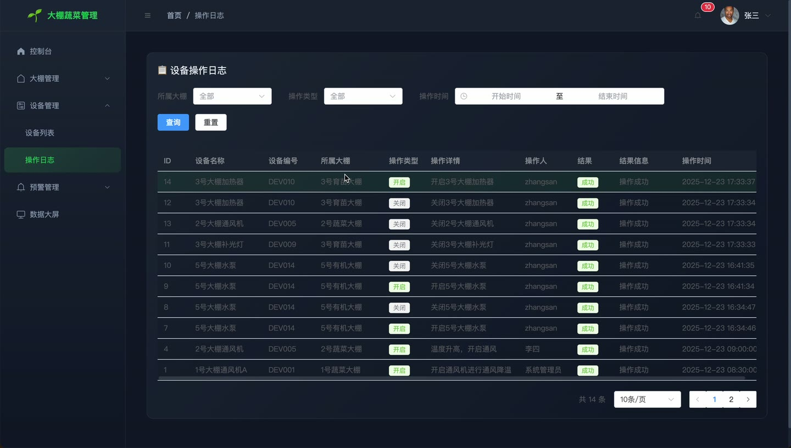
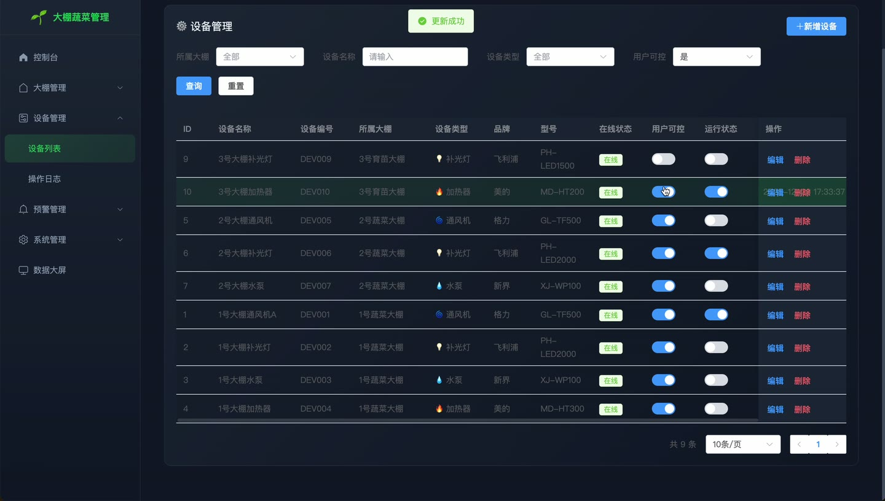

# (附文档)Springboot3+Vue3+MySQL 大棚蔬菜管理系统

**技术栈**：Springboot3、Vue3、MySQL

### 系统简介

本系统是一套基于 Springboot3 + Vue3 的前后端分离的大棚蔬菜环境监控管理系统。系统包含管理员与普通用户两种角色，提供大棚管理、设备控制、环境数据监测、预警阈值设置、数据备份与审计日志等功能，实现对蔬菜大棚的集中化、智能化管理。
 
### 核心功能
 
### 管理员端

 
- 大棚管理：创建、编辑、删除大棚信息，支持按名称/编号/状态筛选分页列表 
- 设备管理：添加、编辑、删除设备（通风机/补光灯/水泵/加热器/降温器），支持按大棚/名称/类型/状态筛选 
- 设备控制：远程开启/关闭设备，记录操作日志，非管理员用户仅可操作允许用户控制的设备 
- 环境数据查看：按大棚分页查看历史环境数据（温度/湿度/光照/土壤湿度/CO2浓度），支持时间范围筛选 
- 环境趋势图表：按大棚查看近 24 小时（可调小时数）的温湿度等参数趋势数据 
- 模拟数据生成：一键生成随机环境数据用于测试与演示 
- 预警阈值管理：为每个大棚设置各参数（温度/湿度/光照/土壤湿度/CO2）的最小值与最大值阈值 
- 预警记录管理：查看预警记录列表（按大棚/级别/状态/时间筛选），手动处理未处理预警并填写处理备注 
- 手动触发预警检测：系统自动比对最新环境数据与阈值，生成 warning 或 danger 级别预警 
- 用户管理：创建、编辑、删除用户，支持按用户名/姓名/角色/状态筛选，可启用/禁用账号 
- 审计日志查看：分页查看所有操作日志（按用户/操作类型/模块/时间筛选），查看日志详情与统计概览 
- 数据备份：手动创建数据库备份（SQL 文件），查看备份记录列表（按类型/时间筛选），支持删除备份与数据恢复 
- 系统配置管理：按 key 获取/保存系统配置项
 
### 普通用户端

 
- 个人资料查看与编辑：修改个人基本信息（用户名、姓名等），上传头像 
- 修改密码：输入原密码与新密码完成密码修改 
- 大棚查看：查看已授权的大棚列表与基本信息 
- 设备查看：查看所属大棚下的设备列表与运行状态 
- 设备控制：对允许用户控制的设备执行开启/关闭操作（受 allowUserControl 字段限制） 
- 环境数据查看：查看所属大棚的实时环境数据与历史记录 
- 预警记录查看：查看所属大棚的预警信息，了解当前异常情况
 
### 公共功能

 
- 登录认证：RSA 加密传输密码，服务端解密后验证用户名密码，记录登录审计日志 
- 仪表盘概览：展示大棚总数、设备统计（总/在线/离线/运行/停止）、预警统计（总/未处理/已处理/warning/danger）、未处理预警列表 
- 大屏数据展示：返回所有大棚列表、最新环境数据、设备统计、预警统计、未处理预警，适用于可视化大屏 
- 文件上传：支持上传图片（大棚图片）与头像，按日期目录存储 
- 分页查询：所有列表接口均支持分页参数（pageNum/pageSize）及多条件组合筛选 
- 审计日志记录：登录、操作等关键行为自动记录操作人、IP、User-Agent、执行时间、结果状态
 
### 技术栈

 后端框架Spring Boot 3.x ORMMyBatis-Plus 权限JWT Token + RSA 加密 + 角色校验（admin/user） 前端框架Vue 3 状态管理Pinia 构建工具Vite 数据库MySQL 数据源HikariCP
 
### 交付内容

 
- 后端完整源码 
- 前端完整源码 
- 数据库初始化脚本 
- 万字文档

## 界面展示

---

## 获取完整源码 + 万字文档

本仓库为项目介绍页。**完整前后端源码、数据库初始化脚本、万字项目文档**，请访问 [codekk.top](http://codekk.top) 获取。

可作课程设计 / 毕业设计参考，支持远程部署调试。